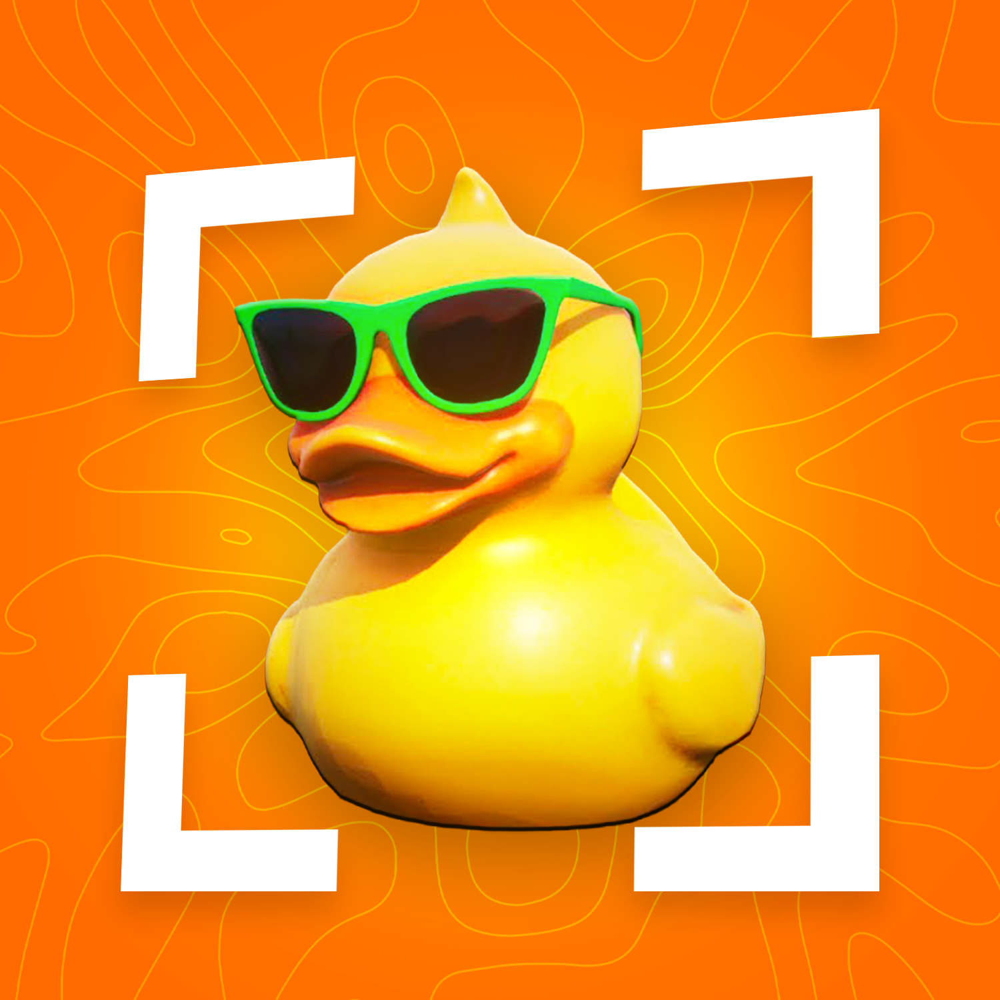

<p align="center">
  
</p>

<h1 align="center">RetracRes</h1>

<p align="center">
  <strong>Stretched &amp; custom Fortnite resolutions — made simple.</strong>
</p>

<p align="center">
  <a href="https://www.retracres.lol"></a>
  <a href="LICENSE"></a>
  <a href="https://github.com/braycarlson/alphares"></a>
</p>

<p align="center">
  <a href="https://www.retracres.lol"><strong>Download the latest build → www.retracres.lol</strong></a>
</p>

---

## Disclaimer

> **RetracRes is an independent fan project.**
>
> It is **not** created, owned, endorsed, or affiliated with the [Retrac Project](https://discord.com/invite/retrac) or its owners.
>
> “Retrac” in the name refers to the stretched / custom resolution experience — not official Retrac Project software.

RetracRes is a modern Windows remake of **[alphares](https://github.com/braycarlson/alphares)** by [Brayden Carlson](https://github.com/braycarlson). Same core idea — custom Fortnite resolution via `GameUserSettings.ini` — rebuilt with a custom dark UI and a crosshair overlay.

---

## Features

| | |
|---|---|
| **Resolution** | Width, Height, FPS (`0` = uncapped) |
| **Presets** | `1440×1080`, `1560×1080`, `1550×1080` |
| **Window modes** | Fullscreen · Borderless · Windowed |
| **Lock file** | Keep Fortnite from overwriting your settings |
| **Revert** | Restore the backup from the first save |
| **Crosshair** | `+` · `×` · Dot · Circle · custom PNG overlay |

---

## Download

Prefer a ready-to-run build? Grab it from the site:

### → [www.retracres.lol](https://www.retracres.lol)

Or build from source below.

---

## Requirements

- **Windows 10** or later
- To build: [MSYS2](https://www.msys2.org/) with MinGW-w64  
  - x64: `mingw-w64-x86_64-gcc`  
  - x86: `mingw-w64-i686-gcc`

---

## Build

```bat
mingw32-make.exe ARCHITECTURE=x64
```

32-bit:

```bat
mingw32-make.exe ARCHITECTURE=x86
```

Output:

```text
bin/RetracRes_x64.exe
bin/font/                  (copied automatically)
```

Clean:

```bat
mingw32-make.exe clean
mingw32-make.exe distclean
```

---

## How to use

### Resolution

1. Close Fortnite.
2. Run **RetracRes**.
3. On the **Resolution** tab, set Width / Height / FPS (or pick a preset).
4. Choose a window mode.
5. Optionally enable **Lock settings file**.
6. Press **Apply**.

**Revert** restores the backup created the first time RetracRes saved settings.

**Borderless / Windowed:** Fortnite follows the Windows desktop size, so RetracRes also switches Windows to your Width × Height. Create that resolution in the NVIDIA/AMD control panel first and set GPU scaling to Full screen / Full panel.

**Fullscreen:** Fortnite changes the display mode itself. If RetracRes previously changed the Windows resolution, it can restore the previous mode.

### Crosshair

1. Open the **Crosshair** tab.
2. Pick a built-in type, color, thickness, and length — or **Load PNG**.
3. Press **Start** for an always-on-top, click-through overlay (sized to Width × Height from the Resolution tab).
4. Press **Stop** to hide it.

Crosshair settings are stored in `%APPDATA%\RetracRes\crosshair.json`.

---

## Configuration path

```text
%LOCALAPPDATA%\FortniteGame\Saved\Config\WindowsClient\GameUserSettings.ini
```

If the file is missing, launch Fortnite once so it can generate settings, then run RetracRes again.

---

## Project layout

```text
RetracRes/
├── src/                 C++ sources (entry: main.cpp)
├── include/             Headers
├── resources/           Win32 .rc + application manifest
├── assets/              Icons and images
├── font/                SF Pro Display (Regular / Medium / Bold)
├── lib/simpleini/       Vendored SimpleIni
├── bin/                 Build output (generated)
├── obj/                 Object files (generated)
├── Makefile
├── LICENSE
├── CONTRIBUTORS.md
└── README.md
```

---

## Credits & attribution

| | |
|---|---|
| **Based on** | [braycarlson/alphares](https://github.com/braycarlson/alphares) |
| **Original author** | [Brayden Carlson](https://github.com/braycarlson) |
| **Original contributors** | See [CONTRIBUTORS.md](CONTRIBUTORS.md) |
| **INI library** | [SimpleIni](lib/simpleini) (vendored; see its licence) |
| **Not affiliated with** | [Retrac Project](https://discord.com/invite/retrac) |

RetracRes keeps the resolution / INI workflow that alphares pioneered. The UI, overlay, and window chrome are new work for this remake.

---

## Notes

- Locking the settings file stops Fortnite from overwriting it. Turn the lock off and Apply when you want in-game changes to stick.
- Display quirks after a custom resolution may still need GPU control-panel tweaks.
- The overlay is click-through and stays above other windows. It does not appear over exclusive fullscreen.

---

## License

MIT — see [LICENSE](LICENSE).

Third-party code (SimpleIni) remains under its own licence in `lib/simpleini/`.
